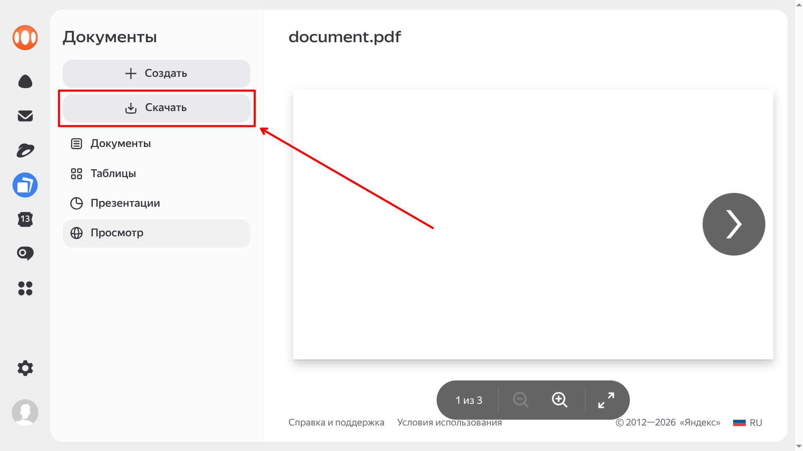
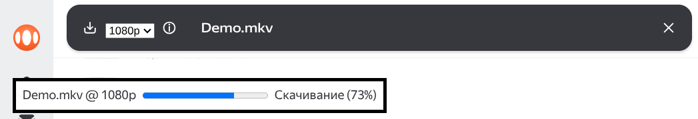
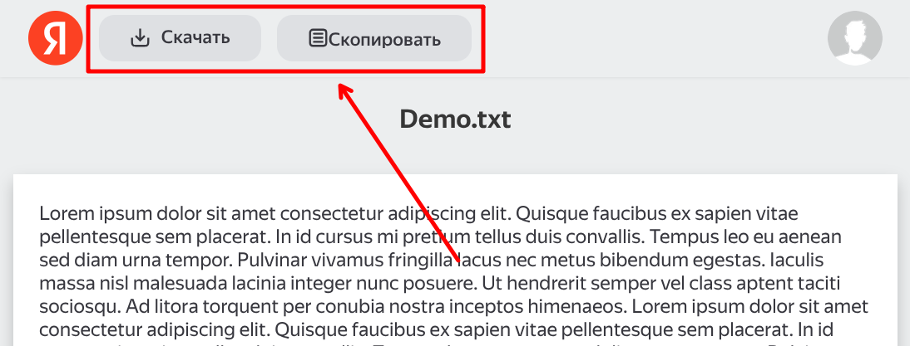

# Yandex Disk Scraper

Юзерскрипт для скачивания файлов из Яндекс Диска с запретом на скачивание.

Мотивация:
- Встроенный просмотрщик файлов в Яндексе неудобный.
    - PDF по страницам и частые капчи.
    - Текстовые файлы нельзя копировать.
- Я хочу сохранять документы на своём компьютере и просматривать их офлайн.

## Установка

Установите скрипт в ваш менеджер юзерскриптов:
https://github.com/wadrodrog/yandex-disk-scraper-userscript/raw/refs/heads/main/yandex-disk-scraper.user.js

- На Firefox лучше использовать [Greasemonkey](https://addons.mozilla.org/firefox/addon/greasemonkey) или [Violentmonkey](https://addons.mozilla.org/firefox/addon/violentmonkey).
- На Chromium лучше использовать [Violentmonkey](https://chromewebstore.google.com/detail/violentmonkey/jinjaccalgkegednnccohejagnlnfdag), если поддерживается. Можно [Tampermonkey](https://chromewebstore.google.com/detail/tampermonkey/dhdgffkkebhmkfjojejmpbldmpobfkfo), но с ним есть проблемы:
    - Если при установке скрипта в Tampermonkey страница не грузится, включите VPN или перезагружайте страницу несколько раз.
    - В Chromium для Tampermonkey надо разрешить расширению пользовательские скрипты. В некоторых случаях может понадобиться включить режим разработчика.
    - С Tampermonkey почему-то медленно формируются PDF-документы.
- На Safari пока не было протестировано, но там есть расширение [Userscripts](https://apps.apple.com/app/userscripts/id1463298887).
- Мобильные версии браузеров не тестировались, скорее всего не будет работать.

Обновления производятся также через менеджер юзерскриптов.

## Использование

Скрипт добавляет кнопку скачивания на различные панели в зависимости от типа файла.
Интерфейс Яндекс Диска неконсистентный, поэтому приходится располагать кнопку где попало.
Кнопки имитируют дизайн Яндекс Диска, но всё равно есть незначительные несоответствия.

Если кнопки не отображаются, или скачивание не начинается, или в целом поведение не такое какое должно быть, то скорее всего в интерфейсе Яндекс Диска что-то изменилось и 
скрипт перестал находить элементы для парсинга.
Смотрите консоль браузера, попробуйте поправить скрипт локально и отправить pull request.

### PDF

Кнопка "Скачать" находится на боковой панели при просмотре документа.

При нажатии на кнопку открывается новая вкладка.
Изображения всех страниц параллельно скачиваются и затем объединяются в один файл.
По завершении процесса итоговый PDF сохраняется на компьютер.

Ограничения и особенности работы:
- Страницы в PDF сохраняются как изображения. Как следствие, текст нельзя выделять и копировать. То же самое происходит и при просмотре в браузере - это ограничение со стороны Яндекса, сервер не отдаёт текст.
- В процессе скачивания Яндекс может закидывать вас капчами. Если из-за этого скачивание не удаётся, то скрипт показывает предупреждение. При появлении капчи нужно начинать скачивание заново.
- Процесс сохранения PDF может сильно нагружать компьютер. В Tampermonkey это происходит очень медленно. Точная причина проблемы неизвестна.
- Иногда скрипт открывает новые вкладки самостоятельно, что может блокироваться браузером. Нужно разрешить всплывающие окна, если такое предложение появится в адресной строке.

### Видео

Кнопка скачивания и селектор форматов появляется на верхней панели в папке или плеере.

Форматы определяются автоматически через незадокументированный API. По умолчанию выбирается наилучшее качество.

При нажатии на кнопку "Скачать" появляется окно поверх интерфейса Яндекс Диска со статусом скачивания.
Фрагменты видео HLS параллельно скачиваются и затем объединяются в один файл.

Должны работать все популярные форматы, но тестировались только .mkv.

Ограничения и особенности работы:
- Можно скачивать сразу несколько видео одновременно, но так не рекомендуется делать.
- Редко может произойти ошибка в скачивании одного фрагмента, из-за чего придётся начинать скачивание всего видео заново.
- Для отмены нужно обновить страницу.

### Текстовые файлы

Откройте текстовый файл, кнопки "Скачать" и "Скопировать" появятся на верхней панели.

Куски текста читаются из DOM и затем объединяются в один файл.

## Лицензия и благодарности

Скрипт опубликован по лицензии [Unlicense](https://unlicense.org).
Если вы нашли этот скрипт полезным и используете его где-либо ещё, просим указать ссылку на оригинальный репозиторий.
А ещё можете оставить ⭐ :3

Духовный наследник https://colab.research.google.com/drive/1GY43-A2uFMahE9-zMH2-mFjPcq5w-mDa

Для формирования PDF используется библиотека [jsPDF](https://github.com/parallax/jsPDF), лицензия MIT.
